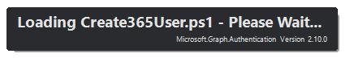
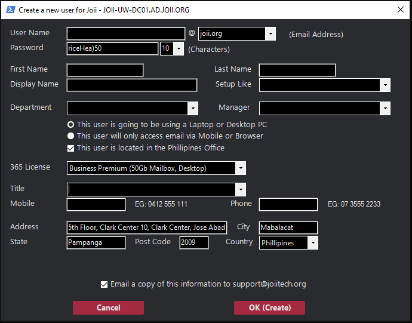

# Create a new 365 and Active Directory User.
A PowerShell Script to create a new user in an ActiveDirectory Domain or a Microsoft Office 365 Tenant.

 References: 
- [Microsoft.Online.SharePoint.PowerShell](https://learn.microsoft.com/en-us/powershell/module/sharepoint-online/connect-sposervice?view=sharepoint-ps)
- https://learn.microsoft.com/en-us/power-apps/developer/data-platform/walkthrough-register-app-azure-active-directory
- https://learn.microsoft.com/en-us/powershell/module/microsoft.graph.authentication/invoke-mggraphrequest?view=graph-powershell-1.0
 

# Instructions

**1.** You will need to gather the Microsoft 365 Tenant ID.

- https://portal.azure.com/ 
- Browse to Microsoft Entra ID > Properties.
- Scroll down to the Tenant ID section and you can find your tenant ID
 

**2.** You will need to create a 365 Entra App that has access to the Exchange.

**3.** You will need to create an Entra User who has full access to the Tenants Sharepoint
 [Microsoft.Online.SharePoint.PowerShell](https://learn.microsoft.com/en-us/powershell/module/sharepoint-online/connect-sposervice?view=sharepoint-ps)  
MS Graph Scopes:  `
'Mail.ReadWrite'
'Mail.ReadBasic.All 
'User.ReadWrite.All' 
'Calendars.Read'
'Application.ReadWrite.All'
'Directory.ReadWrite.All'
'MailboxSettings.Read'
'Contacts.ReadWrite' 
'Directory.Read.All'
'User.Read.All'
'Organization.ReadWrite.All'
'Mail.Read'
'Calendars.ReadWrite' 
'LicenseAssignment.ReadWrite.All'
'Mail.Send'
'MailboxSettings.ReadWrite'
'Organization.Read.All'
'Contacts.Read'
'Mail.ReadBasic'
'Group.ReadWrite.All' `

**4.** You will need to create an Active Directory user which is a member of the "Domain Admins" Group.

 

**5.** Gather all the Tenants Licence IDs.

 

**5.** Update the Create365User.ini file using all the details previously gathered.

 
